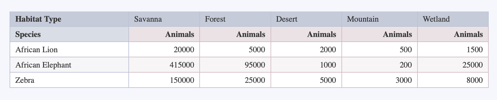

# Explore Tables

React component for rendering pivot tables. Main purpose of the tables is data analysis and visualization. 

Can be used for building in-house ad-hoc pages for data analysis.

## Usage

```tsx
import { PivotTable } from "explore-tables"
// default theme
import 'epxlore-tables/themes/default.css'; 

export default () => {
    // metadata of our dataset
    // used to display proper titles and navigate the rows
    const fields = [
        { id: 'species', name: 'Species' },
        { id: 'habitat_type', name: 'Habitat Type' },
        { id: 'total', name: 'Number of Animals' },
    ];
    // actual data that is morphed into a pivot
    // note that the dataset should be unique between dimensions + pivots
    // in case when duplicate records are found, the pivot table displays the last value
    const rows = [
        {species: 'African Lion', habitat_type: 'Savanna', total: 20000},
        {species: 'African Elephant', habitat_type: 'Savanna', total: 415000},
        {species: 'Zebra', habitat_type: 'Savanna', total: 150000},
        {species: 'African Lion', habitat_type: 'Forest', total: 5000},
        {species: 'African Elephant', habitat_type: 'Forest', total: 95000},
        {species: 'Zebra', habitat_type: 'Forest', total: 25000},
        {species: 'African Lion', habitat_type: 'Desert', total: 2000},
        {species: 'African Elephant', habitat_type: 'Desert', total: 1000},
        {species: 'Zebra', habitat_type: 'Desert', total: 5000},
        {species: 'African Lion', habitat_type: 'Mountain', total: 500},
        {species: 'African Elephant', habitat_type: 'Mountain', total: 200},
        {species: 'Zebra', habitat_type: 'Mountain', total: 3000},
        {species: 'African Lion', habitat_type: 'Wetland', total: 1500},
        {species: 'African Elephant', habitat_type: 'Wetland', total: 25000},
        {species: 'Zebra', habitat_type: 'Wetland', total: 8000}
    ];

    // render the data
    // note that pivot tables do not aggregate the data, but merely display it
    return (
      <PivotTable
          rows={rows} 
          fields={fields}
          measures={["total"]} // fields to display into measures
          dimensions={["species"]} // fields to display into dimensions
          pivots={["habitat_type"]} // fields to display into pivots
      />
    );
}
```

Rendering the table would result into 


## Development

```shell
# start development demo server
npm run dev
```

## Contributions

Pull requests are welcome. For major changes, please open an issue first to discuss what you would like to change.

## Authors & Contacts

* Bogdans <b.ozerkins@outlook.com>
