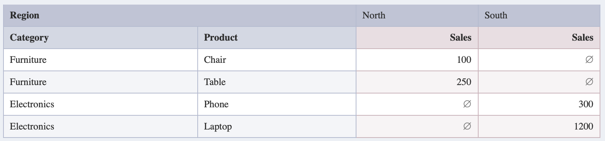

# Explore Tables

A React component library for building interactive pivot tables focused on data analysis and visualization. Perfect for creating in-house analytics dashboards and ad-hoc data exploration pages.

## Features

- Pivot table rendering
- Support for multiple themes
- Override table elements for customizations


## Learn More

📚 Visit our [homepage](https://bozerkins.github.io/explore-tables/#/) for more examples and detailed documentation.

## Quick Start

Install the package:
```shell
npm install explore-tables
```

Import and use:

```tsx
import { PivotTable } from "explore-tables"
import 'explore-tables/themes/default.css'; 

const SimpleTable = () => {
    // The data that is morphed into a pivot during rendering.
    // Note that the dataset should be unique between dimensions + pivots.
    // In case when duplicate records are found, the pivot table displays the last value.
    const data = [
        { category: 'Furniture', product: 'Chair', region: 'North', sales: 100 },
        { category: 'Furniture', product: 'Table', region: 'North', sales: 250 },
        { category: 'Electronics', product: 'Phone', region: 'South', sales: 300 },
        { category: 'Electronics', product: 'Laptop', region: 'South', sales: 1200 },
    ];


    // Render the data.
    // Note that pivot tables do not aggregate the data, but merely display it
    return <PivotTable 
        rows={data}
        fields={[
            { id: 'category', name: 'Category' },
            { id: 'product', name: 'Product' },
            { id: 'region', name: 'Region' },
            { id: 'sales', name: 'Sales' }
        ]}
        dimensions={['category', 'product']}
        measures={['sales']}
        pivots={['region']}
    />
}
```

The above example will render a pivot table like this:


## Important Notes

- Dataset records should be unique between dimensions and pivots
- In case of duplicate records, the pivot table displays the last value
- The pivot table displays data as-is without aggregation

## Development

To run the development server:
```shell
npm run dev
```

## Contributing

We welcome contributions! For major changes, please open an issue first to discuss your proposed changes.

## Authors & Contact

* Bogdans <b.ozerkins@outlook.com>
